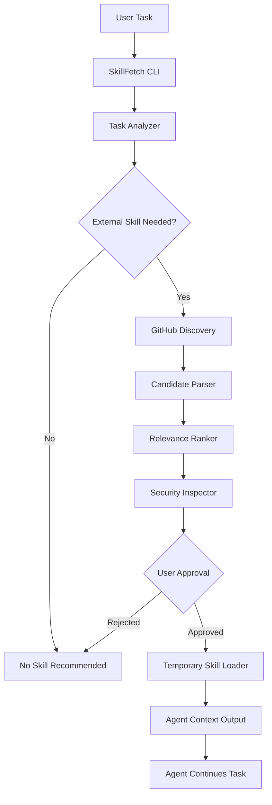

# SkillFetch — Software Design Document

**Version:** 0.1.0
**Status:** Experimental / MVP
**Language:** Python 3.11+
**License:** MIT

## 1. Overview

SkillFetch는 AI 코딩 에이전트가 사용자의 작업 맥락을 분석하고, 필요한 외부 Agent Skill을 자동으로 발견·선택·로딩하도록 지원하는 경량 CLI 도구다.

### Problem

- Agent Skill이 GitHub와 여러 레지스트리에 분산되어 있다.
- 사용자는 필요한 스킬이 존재하는지 알기 어렵다.
- 스킬을 직접 검색·설치·관리해야 한다.
- 설치한 스킬조차 실제로 활용하지 않는 경우가 많다.

### Goal

**Discover skills when needed, not before.**

사용자는 스킬을 검색하거나 미리 설치할 필요 없이 작업 요청만 전달한다.

## 2. Scope

### MVP 포함

1. 사용자 작업 설명 입력
2. 작업 맥락 기반 스킬 검색
3. GitHub 후보 탐색 및 메타데이터 수집
4. LLM 기반 스킬 적합도 평가
5. 스킬 파일 안전성 사전 검사
6. 사용자 승인 후 임시 스킬 로딩
7. 스킬 경로 또는 파일 내용을 에이전트에 전달
8. 로컬 캐시 및 탐색 로그

### MVP 제외

- 스킬 코드 자동 실행
- 완전 자율 설치
- 사용자 승인 없는 파일 수정
- 다중 에이전트 오케스트레이션
- 자체 스킬 마켓플레이스
- 스킬 자동 생성 및 수정
- 사용자 행동 기반 추천 모델 학습

## 3. Architecture



### Design Principles

- **Agent-agnostic:** 특정 코딩 에이전트 SDK에 종속되지 않는다.
- **On-demand:** 필요할 때만 외부 스킬을 탐색한다.
- **Minimal:** 불필요한 프레임워크와 추상화를 피한다.
- **Human-in-the-loop:** 외부 스킬 사용은 사용자 승인을 거친다.
- **No Remote Execution:** MVP에서 외부 스크립트를 실행하지 않는다.
- **Honest Results:** 적합한 스킬을 찾지 못하면 없다고 반환한다.

## 4. Components

### 4.1 Task Analyzer

**Input:** 사용자 작업 설명

**Output:**

```
{
  "task": "React UI 디자인 개선",
  "requires_skill": true,
  "search_queries": [
    "agent skill react design review",
    "frontend design skill"
  ]
}
```

LLM을 사용해 필요한 전문 역량과 검색어를 추출한다.

이미 로컬 스킬이 충분하거나 일반적인 작업이라면 외부 검색을 생략할 수 있다.

### 4.2 Skill Discovery

GitHub Search API를 활용해 외부 스킬 후보를 검색한다.

검색 대상:

- `SKILL.md`를 포함하는 공개 GitHub 저장소
- 사용자가 지정한 저장소 또는 경로

GitHub API 인증 토큰은 환경 변수로 관리한다.

검색 API에서 파일 내용 검색이 제한되는 경우에는 저장소 검색 후 Git Trees API 등으로 실제 `SKILL.md` 존재 여부를 확인한다.

검색 결과가 없거나 API 제한이 발생하면 원인을 구분해 반환한다.

**MVP 제한:** 검색어당 최대 10개 저장소, 총 평가 후보 최대 10개.

### 4.3 Candidate Parser

후보 스킬에서 다음 정보를 추출한다.

```
class SkillCandidate(BaseModel):
    name: str
    description: str
    repository: str
    commit_sha: str
    skill_path: str
    source_url: str
    content: str
```

`SKILL.md`의 frontmatter와 본문을 파싱한다.

메타데이터가 누락되거나 파일 형식이 잘못된 후보는 제외한다.

### 4.4 Relevance Ranker

후보 스킬이 현재 작업에 도움이 되는지 LLM으로 평가한다.

```
class SkillEvaluation(BaseModel):
    relevance: float
    reason: str
    recommended: bool
```

평가 기준:

- Task relevance
- Skill applicability
- Existing capability overlap
- Expected benefit

최대 3개 후보를 추천하며, 적절한 스킬이 없다면 빈 결과를 반환한다.

점수는 비교를 위한 휴리스틱이며, 성능 향상을 보장하지 않는다.

### 4.5 Security Inspector

외부 스킬은 신뢰할 수 없는 입력으로 취급한다.

검사 대상:

- Shell command 및 스크립트 실행 요구
- 환경 변수 또는 비밀정보 접근 요구
- 외부 네트워크 전송 요구
- 기존 사용자 지시를 덮어쓰려는 내용
- 과도한 파일·시스템 접근 요구

**MVP 보안 정책:**

- 위험한 내용이 발견되면 경고 후 자동 로딩 차단
- 스킬의 지시문은 신뢰 가능한 시스템 지시로 승격하지 않음
- 스킬 본문 외의 실행 파일과 의존성은 자동 설치하지 않음
- 정적 검사만으로 안전성을 보장할 수 없음을 명시
- 로딩 전에 원문과 요청 권한을 사용자에게 표시

### 4.6 Temporary Skill Loader

승인된 스킬을 로컬 임시 디렉터리에 저장한다.

```
.skillfetch/
  cache/
  sessions/
    <session-id>/
      SKILL.md
  logs/
```

- Git commit SHA 기준으로 콘텐츠를 고정한다.
- 다운로드 콘텐츠의 크기를 제한한다.
- 임의 경로 이동을 방지한다.
- 실행 가능한 파일은 다운로드하지 않는다.
- 작업 완료 후 세션 파일은 정리할 수 있다.
- 기존 사용자 스킬을 덮어쓰지 않는다.

MVP에서는 CLI가 스킬 파일 경로 또는 텍스트를 반환한다.

에이전트가 출력된 스킬 내용을 자신의 작업 맥락에 포함하는 방식으로 통합한다.

## 5. CLI Interface

### Discover

```
skillfetch discover "Build a React dashboard"
```

출력 예시:

```
Discovering relevant skills...

1. frontend-design
   Relevance: 0.91
   Source: github.com/example/repo
   Reason: Relevant to frontend UI design

Select a skill to inspect [1/none]:
```

### Inspect

```
skillfetch inspect <candidate-id>
```

스킬 원문, 출처, commit SHA, 검사 결과를 출력한다.

### Load

```
skillfetch load <candidate-id>
```

사용자 승인 후 임시 스킬 파일을 생성하고 경로를 출력한다.

### List

```
skillfetch list
```

현재 세션에서 로딩한 스킬 목록을 출력한다.

### Agent Integration

MVP는 특정 에이전트의 내부 자동 호출을 구현하지 않는다.

대신 CLI를 호출할 수 있는 에이전트에서 다음 순서를 실행하도록 얇은 로컬 어댑터를 제공한다.

1. 작업에 외부 스킬이 필요한지 판단
2. `skillfetch discover` 호출
3. 후보를 사용자에게 제시
4. 승인 후 `skillfetch load` 호출
5. 반환된 파일 내용을 작업 지침의 참고자료로 사용

초기 타깃은 Claude Code이며 다른 에이전트는 후속 확장으로 남긴다.

## 6. Technology Stack

| Layer      | Technology       |
| ---------- | ---------------- |
| Language   | Python 3.11+     |
| CLI        | Typer            |
| Validation | Pydantic         |
| HTTP       | httpx            |
| LLM        | OpenAI SDK       |
| Discovery  | GitHub REST API  |
| Storage    | Local Filesystem |
| Testing    | pytest           |

LangChain, 데이터베이스, 서버, 프론트엔드는 사용하지 않는다.

LLM 관련 로직도 MVP에서는 단일 Provider로 제한한다.

## 7. Repository Structure

```
skillfetch/
├── README.md
├── pyproject.toml
├── src/
│   └── skillfetch/
│       ├── cli.py
│       ├── analyzer.py
│       ├── discovery.py
│       ├── parser.py
│       ├── ranker.py
│       ├── security.py
│       ├── loader.py
│       └── models.py
├── integrations/
│   └── claude-code/
│       └── SKILL.md
└── tests/
    ├── test_discovery.py
    ├── test_parser.py
    ├── test_security.py
    └── test_loader.py
```

## 8. MVP Acceptance Criteria

### Functional

- 사용자 작업 설명으로 관련 스킬 후보를 검색할 수 있다.
- GitHub에서 실제 `SKILL.md`를 확인하고 파싱할 수 있다.
- LLM이 후보 적합도와 추천 이유를 반환한다.
- 적합한 후보가 없으면 정상적으로 종료한다.
- 위험 요소를 검사하고 결과를 표시한다.
- 사용자 승인 없이는 외부 스킬을 로딩하지 않는다.
- 로딩된 파일을 에이전트에 전달할 수 있다.
- 임시 파일을 정리할 수 있다.

### Failure Cases

- GitHub API rate limit 처리
- 잘못된 `SKILL.md` 처리
- LLM API 실패 처리
- 네트워크 연결 실패 처리
- 프롬프트 인젝션 의심 스킬 차단
- 경로 조작 및 파일 덮어쓰기 방지

### End-to-End

다음 시나리오가 성공해야 한다.

**Given:** 로컬에 관련 스킬이 설치되지 않은 상태

**When:** 사용자가 특정 작업을 입력했을 때

**Then:** SkillFetch가 관련 외부 스킬을 발견하고, 사용자 승인 후 임시 로딩한 다음, 에이전트가 이를 참고할 수 있어야 한다.

테스트에는 실제 외부 저장소와 별개로 고정된 fixture를 사용한다.

## 9. Exit Criteria

이 프로젝트는 실험적인 토이 프로젝트다.

다음 조건을 확인하면 MVP 개발을 종료한다.

1. 외부 스킬 발견·선택·로딩이 End-to-End로 작동한다.
2. 무관한 스킬을 선택하거나 불필요한 검색을 반복하지 않는지 확인한다.
3. 실제 작업에서 스킬 사용이 도움이 되는 사례와 도움이 되지 않는 사례를 각각 기록한다.

추가 개발 여부는 실제 사용 경험으로 결정한다.

**스킬 자동 탐색의 이점이 검색 시간·토큰 비용·보안 부담을 정당화하지 못하면 개발을 중단한다.**

## 10. Implementation Directive

Implement this SDD as a minimal working prototype.

Constraints:

- Avoid overengineering.
- Implement only the specified MVP.
- No web UI.
- No database.
- No autonomous remote code execution.
- No unnecessary abstraction layers.
- Do not fabricate discovery results.
- Write tests for critical logic.
- Keep the implementation easy to inspect and modify.

**Primary objective: Demonstrate that an agent can discover and load a useful external skill without the user knowing that skill exists beforehand.**